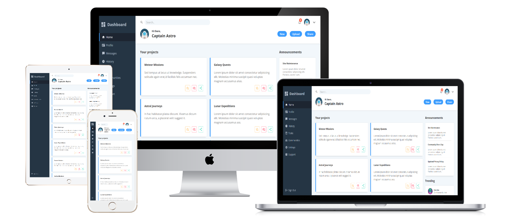

# Admin Dashboard

 
 

## Live Demo

Check it out [Here]() 
 

## About the project

Admin dashboard project was created for [The Odin Project](https://www.theodinproject.com/lessons/node-path-intermediate-html-and-css-admin-dashboard) Intermediate HTML and CSS Course assignment.
the project is considered as a way to showcase the CSS grid knowledge that has been taught so far in the course.

## Main Features

- **CSS Grid** feature was applied for all the main and child elements of the design.
- **CSS Media Queries** for responsive design that seamlessly adjust to different screen sizes for both large desktops and mobile devices.

## Provided assets

- [Tailwind](https://tailwindcss.com/docs/customizing-colors) for the color palettes.
- [Material Design Icons](https://pictogrammers.com/library/mdi/) for SVGs.
- [FlatIcon](https://www.flaticon.com/) for Images.